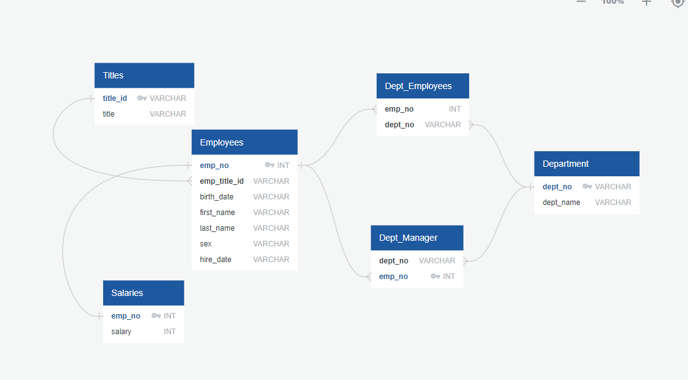

# A 'Major Corporation' in the 1980s and 1990s Analysis
## (sql-challenge)

## Context
In this week's challenge, there will be demostrations of designing tables to hold CSV data and SQL queries by analyzing the employees data at a major corporation. Thorough tasks such as data modeling, data engineering, and data analysis will be demonstrated in this challenge. 

### Data Modeling:
- Diagram image of all existing tables within 'data' folder:

### Data Engineering
[Schema](EmployeeSQL/employee_schema.sql) - Schema displaying how tables and its relationships are joined

### Data Analysis
[Query](EmployeeSQL/employee_query.sql) - Query displays the results and SQL queries to answer questions:

        1. List the following details of each employee: employee number, last name, first name, sex, and salary.

        2. List first name, last name, and hire date for employees who were hired in 1986.

        3. List the manager of each department with the following information: department number, department name, the manager's employee number, last name, first name.

        4. List the department of each employee with the following information: employee number, last name, first name, and department name.

        5. List first name, last name, and sex for employees whose first name is "Hercules" and last names begin with "B."

        6. List all employees in the Sales department, including their employee number, last name, first name, and department name.

        7. List all employees in the Sales and Development departments, including their employee number, last name, first name, and department name.

        8. List the frequency count of employee last names (i.e., how many employees share each last name) in descending order.

### BONUS!
[Bonus](EmployeeSQL/employee_bonus.ipynb) - Bonus activity for assignment

#### Tasks: 
        1. Create a histogram to visualize the most common salary ranges for employees.

        2. Create a bar chart of average salary by title.   
